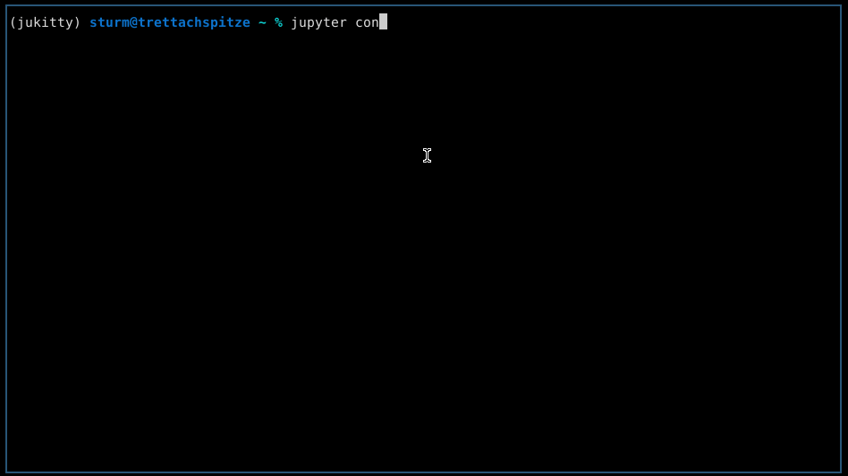

# jukitty
Run jupyter console in [kitty](https://sw.kovidgoyal.net/kitty/) terminal.
View plots directly in the console.



## Status
This project has proof of concept status!
In general, showing plots in the console should work and jupyter console
should behave as normal otherwise.

## Installation
For now, this project has not been submitted to PyPI or conda yet.
Install from github:

```
git clone git@github.com:grst/jukitty.git
cd jukitty
pip install -e .
```

Edit jupyter console configuration to use
```
jupyter console --generate-config  # if not there already
vi ~/.jupyter/console_config.py
```

Add the following lines to your configuration
```
from jukitty.image_handler import show_image
c.ZMQTerminalInteractiveShell.callable_image_handler = show_image
c.ZMQTerminalInteractiveShell.image_handler = 'callable'
```

### Install in a conda environment
To not mess with your default installation, you can try out jukitty in a conda
environment
```
conda create -n jukitty
git clone  git@github.com:grst/jukitty.git
cd jukitty
conda develop .
```

Follow the steps above to integrate `jukitty` in your jupyter console.

## Ideas for future development / Current limitations

### Build a `jukitty lab`
* using tmux and e.g. [jupyter-vim](https://github.com/wmvanvliet/jupyter-vim)
  we could build a full-featured replacement for jupyter lab that runs entirely
  on the console (see [#1](https://github.com/grst/jukitty/issues/1)

### Limitations
* currently, only png images are supported


